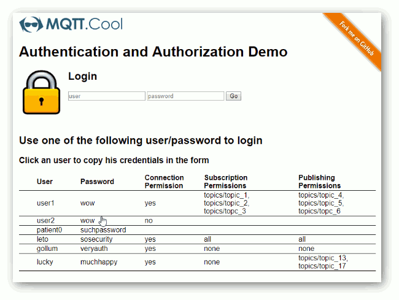
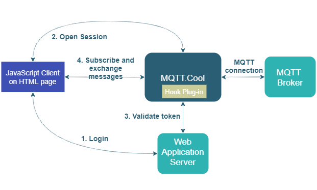

#  Authentication and Authorization Demo - Java Hook

The **Authentication and Authorization Demo** is a simple example
illustrating *authentication* and *authorization* mechanisms when an
*external Web/Application Server* is involved in the process.

This project includes simple web client front-end example and hook
implementation, which supplies user validation and authorization logics.

## Live Demo

[](https://demos.mqtt.cool/auth-hook)

### [ View live demo](https://demos.mqtt.cool/auth-hook)


## Details

The *Authentication and Authorization Demo* illustrates the typical best
practice used for MQTT.Cool Web applications, when a Web/Application server
is involved in the process. The actual authentication is usually handled by the
legacy Web/Application server, irrespective of MQTT.Cool.

from `src/web/app/Main.js`:

```js
[...]

 $.ajax({
   url: 'js/app/login.js',
   type: 'POST',
   data: {
     user: user,
     password: password
  },
[...]
```

Some sort of token is sent back to the Client through cookies, response payload
or any other technique. When the MQTT.Cool Web Client creates a new session,
instead of sending again the full credentials (usually involving a password) to
MQTT.Cool, it sends just the username and the token.

from `src/web/app/Main.js`:

```js
[...]

// Now it is possible to connect to MQTT.Cool, by sending the
// token, not the password.
openSession.connect(Constants.SERVER, user, token, {

[...]
```

The Hook is passed this information and validates the token against the
Web/Application Server that generated it (or a database or whatever back-end
system).

from `src/java/main/cool/mqtt/examples/auth_hooks/AuthHook.java`:

```java
[...]

AuthorizationResult result = authorizationHandler.validateToken(user, password);
if (!AuthorizationResult.OK.equals(result)) {
    throw new HookException(result.getCode(),
        "Unauthorized access: token invalid for user '" + user + "'");
}

[...]
```

Here an overview of the whole sequence:


In this demo client the Web/Application server is not actually involved and
calls to placeholder methods are performed to obtain and extract the token.

Once the user is authenticated on the MQTT.Cool server as explained above, the
client interface presents a link by which the user can connect to the configured
MQTT broker. If the user is allowed to establish a connection, two additional
panels are shown, each one showing a list of topics: from the first panel, the
user can request to subscribe to a topic; from the second panel, the user can
request to publish a random message to a topic. In case a subscription is
accepted and then submitted to the MQTT broker, incoming messages are displayed
on the selected row; in case a publishing is accepted and then delivered to the
MQTT broker, the user is invited to send a new one.

Every time a connection, a subscription or a publishing is requested, MQTT.Cool
proceeds with the authorization check, by delegating to the Hook the
responsibility to verify if the user issuing the request is actually
authorized to access the resource is asking for. A real case might query an
external service to verify the user authorizations; this example simply checks,
for each username, on hard-coded set of permissions the following:
- a list of contactable MQTT brokers
- a list of subscribable topics
- a list of topics to which messages are allowed to be delivered.

from `src/java/main/cool/mqtt/examples/auth_hooks/AuthHook.java`:

```java
[...]

AuthorizationResult result =
    authorizationHandler.authorizeMQTTConnection(user, brokerAddress);
if (!AuthorizationResult.OK.equals(result)) {
    throw new HookException(result.getCode(),
        String.format("Unauthorized access: user '%s' can't connect to broker '%s'",
            user, brokerAddress));
}

[...]

AuthorizationResult result =
    authorizationHandler.authorizeSubscribeTo(user, subscription.getTopicFilter());
if (!AuthorizationResult.OK.equals(result)) {
    throw new HookException(result.getCode(),
        String.format("Unauthorized access: user '%s' can't receive messages from '%s'",
            user, subscription.getTopicFilter()));
}

[...]

AuthorizationResult result =
    authorizationHandler.authorizePublishTo(user, message.getTopicName());
if (!AuthorizationResult.OK.equals(result)) {
    throw new HookException(result.getCode(),
        String.format("Unauthorized access: user '%s' can't publish messages to '%s'",
            user, message.getTopicName()));
}

[...]
```

Querying an external service at each request is a discouraged approach, though.
If the authorizations are actually placed on an external service, it is
suggested to use the approach shown in the `AuthHookWithAuthCache` class where
authorizations are queried at session startup and cached in the Hook itself.

More details and comments on how the authentication/authorization cycle is
accomplished is available in the source code of the application.

This demo uses a simple Node.js application to feed the MQTT broker with
random messages (at fixed interval of 500 ms), which can be displayed on the
subscription panel once the related subscription is made.

### Overall Architecture

Here the overall architecture of the demo:



## Install

If you want to install a version of this demo pointing to your local MQTT.Cool,
follows these steps.

* As prerequisite, this demo needs an up and running MQTT broker. You can choose
whatever MQTT broker you prefer, or may also use one of the available public
broker (an up-to-date list is maintained at
[https://github.com/mqtt/mqtt.github.io/wiki/public_brokers](https://github.com/mqtt/mqtt.github.io/wiki/public_brokers)).
* Download and configure an MQTT.Cool instance. Please refer to mqtt.cool web site
[download page](https://mqtt.cool/download/latest-server) to find the MQTT.Cool
package. MQTT.Cool comes with a set of predefined configurations for
connecting with local MQTT server instances, as well as with the most common
publicly accessible brokers. If you want to provide a new custom configuration,
open the `mqtt_master_connector_conf.xml` file located under
`<MQTT.COOL_HOME>/mqtt_connectors` and provide a set of entries similar to the
following (please refer to the inline documentation for more in-depth
information on how to configure broker connection parameters):

  ```xml
  ...
  <!-- MQTT broker connection parameters for a local instance
       listening on port 1883, aliased by "mybroker". -->
  <param name="mybroker.server_address">tcp://localhost:1883</param>
  <param name="mybroker.connection_timeout">5</param>
  <param name="mybroker.keep_alive">20</param>
  ...
  ```
  - Get the `deploy.zip` file from the releases of this project, unzip it and
    copy the `demo-auth-hooks-1.1.0.jar` from `lib` into
    `<MQTT.COOL_HOME>/mqtt_connector/lib`.
  - As the project contains two different Hook implementations,
    `cool.mqtt.examples.auth_hooks.AuthHook` and
    `cool.mqtt.examples.auth_hooks.AuthHookWithAuthCache`, edit the
    `mqtt_master_connector_conf.xml` file adding the class name of the Hook you
     are going to use, in the `<param name="hook">` tag, just before
    `<master_connector>`:

    -  for the direct version:
       ```xml
       <param name="hook">cool.mqtt.examples.auth_hooks.AuthHook</param>
       ```
    -  for the cached version:
       ```xml
       <param name="hook">cool.mqtt.examples.auth_hooks.AuthHookWithAuthCache</param>
       ```
* Launch the MQTT.Cool server.
* Download this project.
* As the latest version of the MQTT.Cool JavaScript library is always available
through [`unpkg`](https://unpkg.com/#/), it is hot-linked in the html page.
* jQuery is currently hot-linked in the html page: you may want to replace it
with a local version and/or to upgrade its version.
* Deploy this demo on MQTT.Cool (used as Web server) or in any external Web
server. If you choose the former, create a folder with name such as
`AuthDemo` under the `<MQTT.COOL_HOME>/pages` folder, and copy there the
contents of `src/web` of this project.
* If required, install Node.js
* From the `src/feed` folder, locally install the feed application:

 ```
 npm install
 ```

## Build

To build your own version of `demo-auth-hooks-1.1.0.jar`, instead of using the one
provided in the `deploy.zip` file from the [Install](#install) section above,
follow these steps:

* Assuming that `maven` is installed on your machine, build the Hook by
executing the `package` goal:

```sh
$ mvn package
```

* Locate the jar file (which should be in the `target` folder) and drop it into
`<MQTT.COOL_HOME>/lib`.

## Configure

The demo assumes that the MQTT.Cool server is launched from localhost, but if
you need to target a different server, search in `src/web/js/app/Main.js`
this line:

```js
MQTT_COOL_URL: 'http://localhost:8080',
```

and change it accordingly.

Further, the demo will look for the **mosquitto** alias, which is one of the
predefined configurations in `mqtt_master_connector_conf.xml`. Once more, if you
need to target a different MQTT broker, and provided that relative connection
parameters are already defined as shown above, modify the following line in
`src/web/js/app/Main.js`:

```js
mqttClient = mqttCoolSession.createClient('mosquitto');
```

and change it by replacing **mosquitto** with the new alias that maps the MQTT
broker you are going to use.

## Launch

Open your browser and point it to
[http://localhost:8080/AuthDemo](http://localhost:8080/AuthDemo), or to the
address according to the host and/or the name of the folder where you deployed
the project.

From the `feed` folder, run the feed application to publish random messages:

```sh
npm start <url_broker>
```

where `url_broker` is the url of the MQTT broker relative to the alias in use.

## See Also

* [Check out all other demos on MQTT.Cool site](https://mqtt.cool/demos)

## MQTT.Cool Compatibility Notes

* Compatible with MQTT.Cool SDK for Web Clients version 1.0.0 or newer.
* Compatible with MQTT.Cool SDK for Java Hooks version 1.0.0 or newer.
* Compatible with MQTT.Cool since version 1.x.x.

