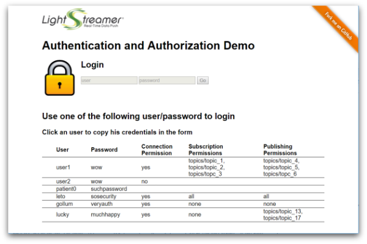

# MQTT Extender - Authentication and Authorization Demo - HTML Client

The **MQTT Extender Authentication and Authorization Demo** is a simple example
illustrating *authentication* and *authorization* mechanisms when an
*external Web/Application Server* is involved in the process.

This project includes a simple web client front-end example for the [MQTT
Extender - Authentication and Authorization Demo - Java Hook](https://github.com/Lightstreamer/MQTTExtender-example-Auth-Hook-java).



## Details

This *Authentication and Authorization Demo* illustrates the typical best
practice used for MQTT Extender Web applications, when a Web/Application server
is involved in the process. The actual authentication is usually handled by the
legacy Web/Application server, irrespective of MQTT Extender.

from `src/web/app/Main.js`:
```js
[...]

 $.ajax({
   url: 'js/app/login.js',
   type: 'POST',
   data: {
     user: user,
     password: password
  },
[...]
```
Some sort of token is sent back to the Client through cookies, response payload
or any other technique. When the MQTT Extender Web Client creates a new session,
instead of sending again the full credentials (usually involving a password) to
MQTT Extender, it sends just the username and the token.

from `src/web/app/Main.js`:
```js
[...]

// Now it is possible to connect to MQTT Extender, by sending the
// token, not the password.
MQTTExtender.connect(Constants.SERVER, user, token, {

[...]
```

The Hook is passed this information and validates the token against the
Web/Application Server that generated it (or a database or whatever back-end
system).

from `src/java/mqttextender/auth_demo/hooks/AuthHook.java`:
```java
[...]

AuthorizationResult result = AuthorizationRequest.validateToken(user, password);
if (!AuthorizationResult.OK.equals(result)) {
    throw new HookException("Unauthorized access: token invalid for user '" + user + "'",
        result.getCode());
   }

[...]
```

Here an overview of the whole sequence:


In this demo client the Web/Application server is not actually involved and
calls to placeholder methods are performed to obtain and extract the token.

Once the user is authenticated on the MQTT Extender as explained above, the
client interface presents a link by which the user can connect to the configured
MQTT broker. If the user is allowed to establish a connection, two additional
panels are shown, each one showing a list of topics: from the first panel, the
user can request to subscribe to a topic; from the second panel, the user can
request to publish a random message to a topic. In case a subcription is
accepted and then submitted to the MQTT broker, incoming messages are displayed
on the selected row; in case a publishing is accepted and then delivered to the
MQTT broker, yhe user is invited to send a new one.

Every time a connection, a subscription or a publishing is requested, the MQTT
Extender proceeds with the authorization check, by delegating to the Hook the
responsibility to verify if the user issuing the request is actually
authorized to access the resource is asking for. A real case might query an
external service to verify the user authorizations; this example simply cheks
on hard-coded set of permissions which specify, for each username, whether the
target MQTT broker is allowed to be connected and the list of  subscribable and
publishable topics.

from `src/java/mqttextender/auth_demo/hooks/AuthHook.java`:
```java
[...]

AuthorizationResult result =
    AuthorizationRequest.authorizeMQTTConnection(user, brokerAddress);
if (result != AuthorizationResult.OK) {
    throw new HookException("Unauthorized access: user '" + user +
        "' can't connect to broker '" + brokerAddress + "'",
        result.getCode());
}

AuthorizationResult result =
    AuthorizationRequest.authorizeSubscribeTo(user, subscription.getTopicFilter());
if (result != AuthorizationResult.OK) {
    throw new HookException(
        String.format("Unauthorized access: user '%s' can't receive messages from '%s'",
            user, subscription.getTopicFilter()),
        result.getCode());
}

[...]

AuthorizationResult result =
    AuthorizationRequest.authorizePublishTo(user, message.getTopicName());
if (result != AuthorizationResult.OK) {
    throw new HookException(
        String.format("Unauthorized access: user '%s' can't publish messages to '%s'",
            user, message.getTopicName()),
        result.getCode());
}

[...]
```

Querying an external service at each request is a discouraged approach, though.
If the authorizations are actually placed on an external service, it is
suggested to use the approach shown in the `AuthHookWithAuthCache` class where
authorizations are queried at session startup and cached in the Hook itself.

More details and comments on how the authentication/authorization cycle is
accomplished is available in the source code of the application.

This demo uses a simple Node.js application to feed the MQTT broker with
random messages (at fixed interval of 500 ms), which can be displayed on the
subscription panel once the related subscription is made.

## Install

If you want to install a version of this demo pointing to your local MQTT
Extender, follows these steps.

* As prerequiste, this demo needs a MQTT infrastructure to run. You can choose
whatever MQTT broker you prefer, or may also use one of the avaible public
broker (an update-to-date list is maintaned at
[https://github.com/mqtt/mqtt.github.io/wiki/public_brokers]()).
* Configure a MQTT Extender instance. Please refer to Lightstreamer
web site [download page](http://download.lightstreamer.com/) to find the MQTT
Extender download package. MQTT Extender comes with a set of predefined
configurations for connecting with local MQTT server instances, as well as with
the most common publicly accessible brokers. If you want to provide a new custom
configuration, open the `mqtt_master_connector_conf.xml` file located under
`<MQTTEXTENDER_HOME>/conf` and provide a set of entries similar to the following
(please refer to the inline documentation for more in-depth information on how
to configure broker connection parameters):
  ```xml
  ...
  <!-- MQTT broker connection parameters for a local instance
  listening on port 1883, aliased by "mybroker". -->
  <param name="mybroker.server_address">tcp://localhost:1883</param>
  <param name="mybroker.connection_timeout">5</param>
  <param name="mybroker.keep_alive">20</param>
  ...
  ```
  - Get the `deploy.zip` file from the releases of this project, unzip it and
    copy the `MQTT_Auth_demo.jar` from `lib` into the `mqtt_connectors/lib`
    folder of your MQTT Extender installation.
  - As the project contains two different Hook implementations, `mqttextender.auth_demo.hooks.AuthHook` and
    `mqttextender.auth_demo.hooks.AuthHookWithAuthCache`, edit the
    `mqtt_master_connector_conf.xml` file adding the class name of the Hook you
     are going to use, in the `<param name="hook">` tag, just before
    `<master_connector>`:

    -  for the direct verion:
       ```xml
       <param name="hook">mqttextender.auth_demo.hooks.AuthHook</param>
       ```
    -  for the cached version:
       ```xml
       <param name="hook">mqttextender.auth_demo.hooks.AuthHookWithAuthCache</param>
       ```
* Launch the MQTT Extender.
* Download this project.
* RequireJS is currently hot-linked in the html page: you may want to replace it
with a local version and/or to upgrade its version.
* jQuery is currently hot-linked in the html page: you may want to replace it
with a local version and/or to upgrade its version.
* Deploy this demo on the MQTT Extender (used as Web server) or in any external
Web server. If you choose the former, create a folder with name such as
`AuthDemo_MQTT` under the `<MQTTEXTENDER_HOME>/pages`, and copy there the
contents of the `src/web` folder of this project.
* If required, install Node.js
* From `src/feed` folder, get the [MQTT.js](https://github.com/mqttjs/MQTT.js)
client library, which is required by the feed application:

 ```
 npm install mqtt
 ```

## Build

To build your own version of `MQTT_Auth_demo.jar`, instead of using the one
provided in the `deploy.zip` file from the Install section above, follow these
steps:

* Assuming javac and jar are available on the path, from the command line run:
  ```sh
  javac -classpath ./lib/ls-mqtt-hook-interface.jar -d ./classes ./src/mqttextender.auth_demo/hooks/*.java
  ```
* Then create the jar:
 ```sh
  jar cvf MQTT_Auth_demo.jar -C classes ./
  ```

* Copy the just compiled `MQTT_Auth_demo.jar` in the `mqtt_connectors/lib`
folder of your  MQTT Extender installation.

## Configure

The demo assumes that MQTT Extender is launched from localhost, but if you need
to target a different server, search in `web/js/app/Constants.js` this line:
```js
var SERVER_ADDRESS = 'localhost:8080';
```

and replace `localhost:8080` with required address.

Further, the demo will look for the **mosquitto** alias, which is predefined in
the default MQTT Extender configuration. Once more, if you need to target a
different MQTT broker, and provided that relative connection parameters are
already defined as shown above, modify the following line in
`web/js/app/Main.js`:

```js
var mqttClient = mqttExtenderSession.createClient('mosquitto');
```

and change it by replacing **mosquitto** with new alias mapping the MQTT broker
you are going to use.

## Launch

Open your browser and point it to [http://localhost:8080/AuthDemo_MQTT](), or
to the address according to the host and/or the name of the folder where you
deployed the project.

From the `feed` folder, run the feed application to publish random messages:
```
node generate.js
```

## See Also

## MQTT Extender Compatibility Notes

* Compatible with MQTT Extender Web Client SDK version 1.0 or
newer.
* Compatible with MQTT Extender since version 1.0 or newer.